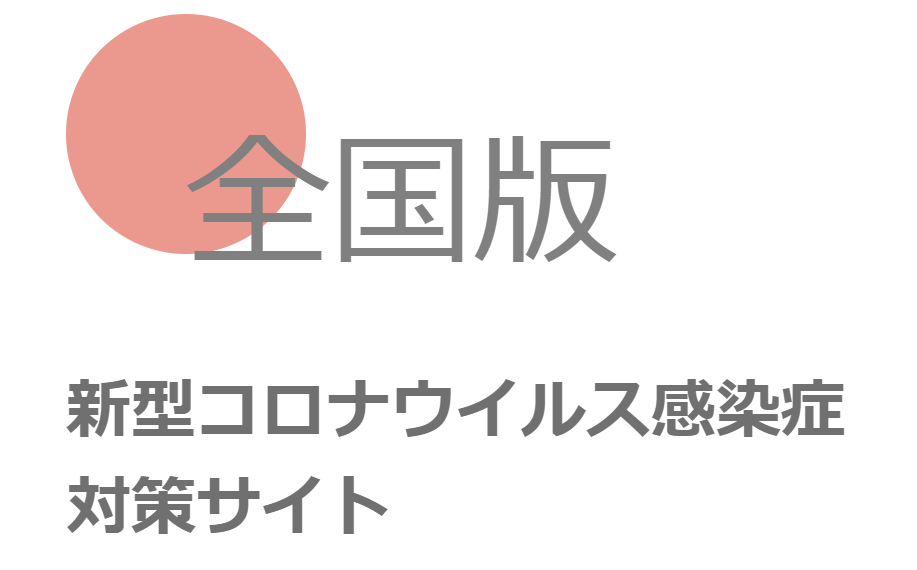

# 新型コロナウイルス感染症対策サイト 全国版

## ライセンス
本ソフトウェアは、[MITライセンス](./LICENSE.txt)の元提供されています。

## 開発者向け情報
開発者向けの情報やサイト構築における行動原則などは本家リポジトリである[tokyo-metropolitan-gov/covid19](https://github.com/tokyo-metropolitan-gov/covid19)を参照してください。

